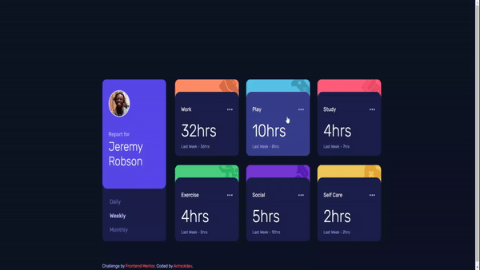

# Frontend Mentor - Time tracking dashboard

This is a graphical interface that simulates a time tracking app.

## Features of the App

- Mobile-friendly and Mobile responsive Interface

- Javascript api simulation

- Grid CSS

## Project demostration

### I used the following technologies to complete this time tracking app challenge:

HTML, CSS grid and js script to work on all the interactive animation part with the mouse

### Live demo project [here](https://arirockdev.github.io/time-tracking-dashboard/) 

This is the [link](https://arirockdev.github.io/time-tracking-dashboard/) for the deploy project

